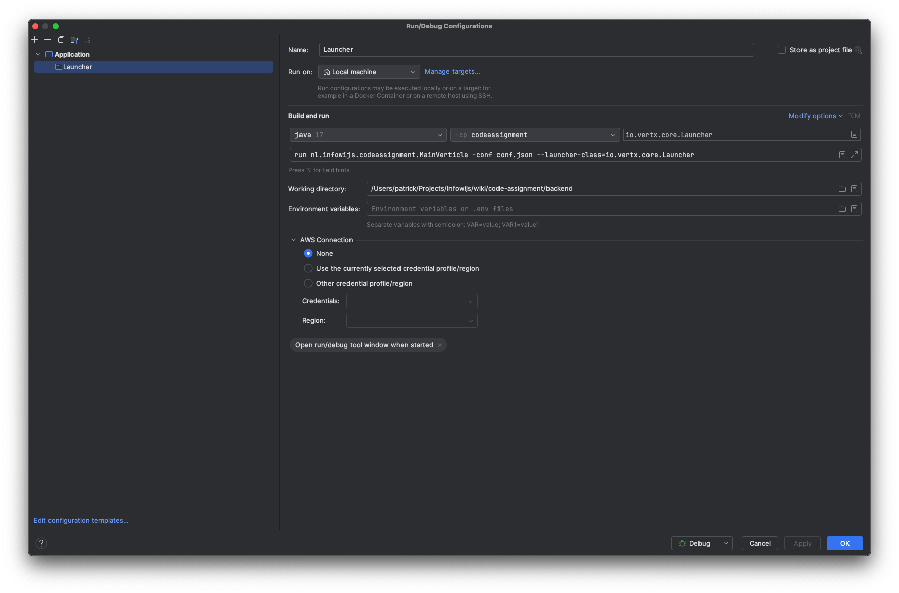

# Code Assignment Backend

This application was initially generated using http://start.vertx.io

## Building

To launch your tests:
```
./mvnw clean test
```

To package your application:
```
./mvnw clean package
```

To run your application:
```
./mvnw clean compile exec:java
```

> To enable loading configuration from conf.json, make sure the following elements are in place in `pom.xml`.
> ```xml
> <project>
>   <build>
>     <plugins>
>       <plugin>
>         <configuration>
>           <arguments>
>             <argument>run</argument>
>             <argument>${main.verticle}</argument>
>             <argument>-conf</argument>
>             <argument>conf.json</argument>
>           </arguments>
>         </configuration>
>       </plugin>
>     </plugins>
>   </build>
> </project>
> ```

## How to create a JSON Web Key Set (JWKS) to sign JWT tokens?

Execute the `generateJwks.sh` script in your terminal in the root of the `backend` folder.
This will write a self-signed JWKS and add it to a `conf.json` file.

```shell
sh generateJwks.sh
```

When asked for a keystore password, fill the password that can be found in `Authorization.kt` as `private val privateKeyPassword = ...`

## Authentication

To sign in with the authentication endpoint, we created an initial user:

```
username: user@infowijs.nl
password: th1sisaveryhardpassword
```

## How to run Vert.x in Intellij?

1. In the menu, go to `Run` → `Edit Configurations`
2. Press the + icon
3. Choose `Application` from the menu
4. Enter any name: eg. `code-assignment`
5. Below "Build and Run" change the following fields:
   1. "module not specified": Choose `java 17` or any equivalent
   2. "-cp <no module>": Choose `-cp codeassignment:` or any equivalent
   3. "Main class" into `io.vertx.core.Launcher`
   4. "Program arguments" into `run nl.infowijs.codeassignment.MainVerticle -conf conf.json --launcher-class=io.vertx.core.Launcher`
   5. Make sure your working directory is set to the backend folder of the code assignment repo.
6. Press "apply" and/or "OK"
7. Choose to Run or Debug `code-assignment`, _or equivalent if you choose a different name at step 4._

### Here's a sample of how it should look:



## Help

* [Vert.x Documentation](https://vertx.io/docs/)
